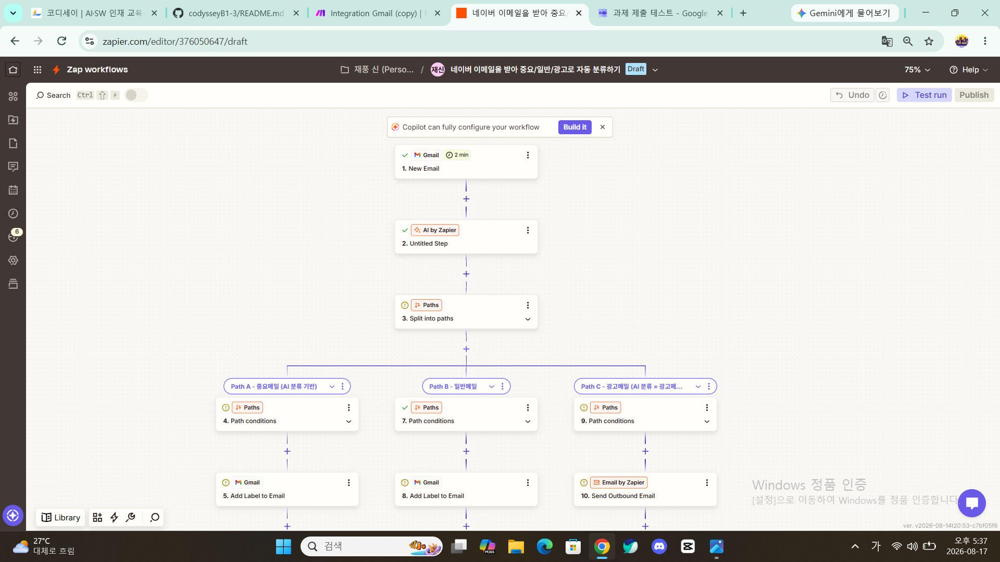

# No-Code Automation Workflow Project

## 프로젝트 소개

본 프로젝트에서는 노코드 자동화 도구인 **Make**와 **Zapier**를 활용하여 동일한 자동화 워크플로우를 구현하고 두 도구를 비교 분석하였다.

또한 반복적으로 수행하는 업무를 자동화하는 파이프라인을 직접 설계하고 구현하여 자동화 과정과 동작 원리, 그리고 확장 가능성을 학습하였다.

---

# 프로젝트 1. 자동화 도구 비교 구현

## 자동화 주제 : 이메일 관리 노코드 자동화 ( 1단계 )
우리들은 휴대폰과 컴퓨터를 가지고 생활을 하면서 수많은 이메일을 접하게 되는 데, 자신에게 편리하고 유익한 만큼 이메일 관리도 잘 해야 된다고 생각은 하고 있지만 바쁜 생활 속에서 현실적으로 그렇지 못한 경우가 많습니다. 그래서 저는 이러한 생활을 개선하기 위해 이메일 관리 노코드 자동화를 생각하게 되었습니다. 
새 이메일을 받으면 3가지로 자동분류를 하도록 합니다. 
즉 1.중요메일, 2.일반메일, 3.광고메일로 자동분류하여 
중요메일은 장기보관하고, 일반메일은 중기보관하고, 광고메일은 단기보관하다가 자동삭제되도록 하는
이메일 관리 노코드 자동화를 제작하게 되었습니다.

---

## 워크플로우 구조

Trigger:  Gmail (Watch Emails) 새 이메일 수신   
`↓`      
`↓`  
`↓`     
Filter:   3가지 메일함 지정과  자동 조건분기  
`↓`        
`↓`  
`↓`  
Action 1: Gmail에 3개의 분류함 생성과 자동처리
   
        
---

## 각 도구별 워크플로우 구성 화면 캡쳐
저는 Make와 Zapier의 2개 도구로 위와 같은 동일한 자동화 워크플로우를 구현하였습니다.

## 1. Make
   
   

## 2. Zapier

   

   

## 실행결과 화면 캡쳐  
( 이메일의 3가지 분류 화면 )

### 1. 중요메일

---
### 2. 일반메일

---
### 3. 광고메일

---

## 비교 분석 보고서  (Markdown)
### 1. Make와 Zapier의 비교 분석
(업무 요구사항 기준)
|비교 항목|Make|Zapier|
|---|---|---|
|UI/UX|시각적인 노드 방식|단계별 리스트 방식|
|설정 난이도|초기 학습이 필요함|초보자도 쉽게 사용 가능|
|조건 분기|Filter 및 Router 지원|Filter 지원|
|실행 결과 확인|Scenario 실행 로그 제공|Task History 제공|
|무료 플랜|무료 사용량이 비교적 많음|무료 플랜 제한이 비교적 적음|
|장점|- 시각적으로 워크플로우를 구성할 수 있다. - 복잡한 자동화 및 조건 분기에 강하다. - 다양한 서비스 연동이 유연하다.|- 직관적인 UI로 빠르게 설정 가능하다. - 단순 자동화에 매우 적합하다.|
|단점|- 초기 학습 난이도가 있다. - 구조 이해에 시간이 필요하다.|- 복잡한 로직 구성에 한계가 있다. - 무료 플랜 제한이 크다.|
|비교결과|복잡한 자동화나 다양한 조건 분기에 적합|간단한 자동화를 빠르게 구축하는 데 적합|

---

# 프로젝트 2. 자유 주제 자동화 설계 및 구현

## 이메일 관리 노코드 자동화 (2단계)
자동화할 반복업무 1개 정의 :  
현대인은 업무, 학습, 쇼핑, 커뮤니티 활동 등으로 인해 매일 많은 이메일을 수신합니다. 하지만 수신된 이메일을 일일이 확인하고 중요도에 따라 분류하는 작업은 반복적이고 많은 시간을 소모합니다. 또한 광고성 메일이 계속 누적되면 중요한 메일을 놓칠 가능성이 높아집니다.

따라서 본 프로젝트에서는 새 이메일이 도착할 때 자동으로 중요메일, 일반메일, 광고메일로 분류하고, 분류 결과에 따라 보관 기간을 다르게 적용하는 이메일 관리 자동화를 구현하고자 합니다.

자동화 도구 1개 선정 및 선정 이유 :  
첫째, Make는 시각적인 워크플로우 구성 방식을 제공하여 자동화 과정을 한눈에 확인할 수 있습니다.

둘째, Router와 Filter 기능을 활용하여 중요메일, 일반메일, 광고메일과 같이 여러 조건으로 이메일을 분기 처리할 수 있습니다.

셋째, Gmail, AI(예, ChatGPT, Claude), Google Sheets 등 다양한 서비스와의 연동이 쉬워 이메일 분류 결과를 기록하고 관리하기에 적합합니다.

넷째, 무료 플랜에서도 비교적 많은 작업량을 제공하여 학습 및 프로젝트 수행에 유리합니다.

따라서 본 프로젝트의 이메일 자동 분류 및 보관 자동화에는 Make가 가장 적합한 도구라고 판단하였습니다.

## 워크플로우 구조  

1. 워크플로우 설명
   Gmail로 수신된 이메일을 자동으로 분류하고, 중요 메일은 ChatGPT를 활용하여 핵심 내용을 요약한 뒤
   Google Spreadsheet에 자동 저장하는 스마트 이메일 관리 자동화 시스템입니다.  

|단계|모듈|역할|   
|---|---|---|  
|Trigger|	Gmail (Watch Emails)|	새 이메일 수신 감지|  
|Filter 1|	조건 분기|	이메일을 중요, 일반, 광고 메일로 분류|  
|Action 1|	Gmail|분류 결과에 따라 각 메일함으로 자동 이동|  
|Filter 2|	AI (ChatGPT)|중요 메일 중 긴 문장 포함 여부 확인|  
|Action 2|	ChatGPT|중요 메일 내용을 자동 요약|  
|Action 3|	Google Spreadsheet|요약 결과를 자동 저장 및 보관|  

3. 워크플로우 다이어그램  
┌─────────────────────┐  
│ Gmail : Watch Emails │  
│ (새 이메일 수신)      │  
└──────────┬──────────┘
│
▼
┌─────────────────────┐  
│ Filter : 메일 분류    │  
│ 중요 / 일반 / 광고    │  
└──────────┬──────────┘
           │
           ▼  
┌─────────────────────┐  
│ Gmail 자동 분류      │  
│ ① 중요메일함         │  
│ ② 일반메일함         │  
│ ③ 광고메일함         │  
└──────────┬──────────┘
           │
           ▼
┌─────────────────────┐  
│ AI(ChatGPT) 필터     │  
│ 중요메일 + 긴 문장   │  
└──────────┬──────────┘
           │
           ▼
┌─────────────────────┐  
│ ChatGPT 요약         │  
│ 핵심내용 3~5줄 생성  │  
└──────────┬──────────┘
           │
           ▼
┌─────────────────────┐  
│ Google Spreadsheet   │  
│ 요약문 자동 저장     │  
└─────────────────────┘  

---
워크플로우 설계 문서 (설명 또는 다이어그램 포함)  

Trigger: Gmail  ( Watch Emails ) 새 이메일 수신  
   ↓  
   
Filter: 3가지 메일함 지정과  자동 조건분기  
   ↓  
   
Action 1: Gmail에 3개의 분류함 생성과 자동처리  
   ↓  
   
Filter: AI ( ChatGPT ) 중요메일 중에서 긴 문장 자동요약  
   ↓  
   
Action 2: Spreadsheet 요약문서 자동보관  

  
| 단계 | 모듈 명칭 | 역할 및 조건 |
| :--- | :--- | :--- |
| **Trigger** | Gmail | 특정 라벨/조건의 새 메일 감지 |
| **Filter** | 조건 필터 | 이메일 3분류 |
| **Action 1** | AI: Chat GPT | 중요메일 자동요약 |
| **Action 2** | Spreadsheet | 요약문서 자동보관 |

## 1. 시나리오 구현 화면 캡쳐  
( 이미지 첨부 : Make에서 실제 제작한 시나리오 화면 캡처 )

## Make 시나리오 구현 화면

.png)

실행결과 화면 캡쳐

2. 자동 실행 증빙 및 동작 방식
이 시스템이 사용자의 수동 개입 없이 어떻게 자동으로 돌아가는지 설명합니다.

## 자동 실행 증빙 및 결과
본 시스템은 새 이메일 수신 시 수동 작업 없이 100% 자동으로 실행됩니다.

1. Gmail로 새 메일 도착 (Trigger 감지)
2. 필터 조건을 통한 키워드 선별 (Filter 판단)
3. AI연동Chat GPT Action 1 긴문장 이메일요약
4. 스프레드시트 전송 (Action 2)

   
## 느낀 점

이메일 수신부터 기록 및 알림까지의 과정을 자동화하여 중요 메일 누락 방지 및 업무 응답 속도를 크게 개선할 수 있음을 확인했습니다.
